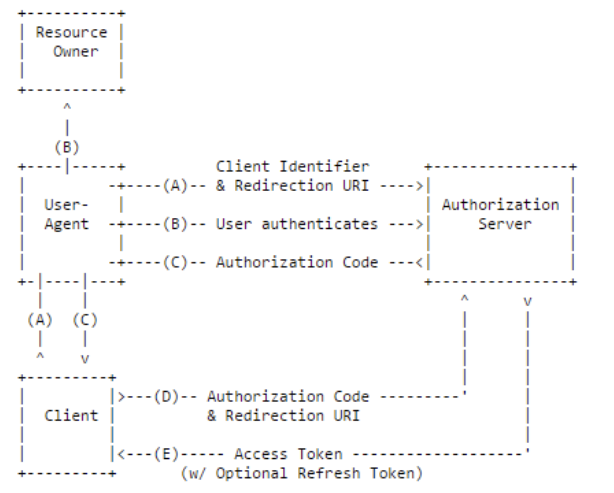
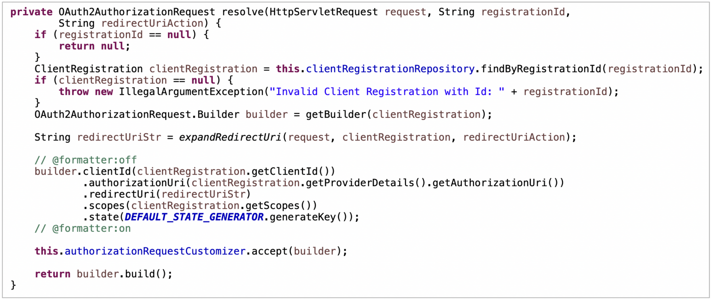
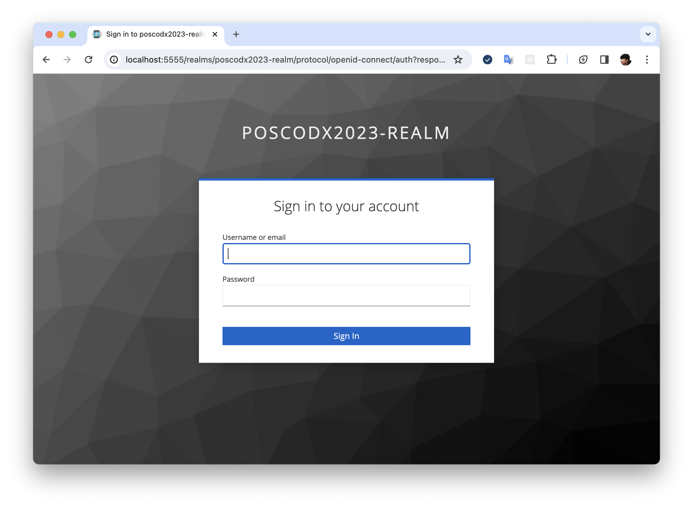

## 2. Authorization Code  Grant

### Flow Diagram



#### Flow "A"
1. 사용자(Resource Owner)는 브라우저(User-Agent)를 통해 클라이언트(Client)에게 권한을 인가하기 위해 URI(/oauth2/authorize)로 접근한다.
2. 인가서버(Authorization Server)의 이 인가에 대한 승인(Grant)도 필요하기 때문에 클라이언트의 사용자의 권한 인가 엔드포인트는 인가서버의 인가 엔드포인트(Authorization Endpoint, authorization-uri)로 리다이렉트 된다.

3. 클라이언트가 인가서버의 인가 엔드포인트로 리다이렉트 할 때, 함께 전달되어야 하는 파라미터는 다음과 같다.
	- 인가서버에 미리 등록된 클라이언트 고유 아이디(Clinet Identifier, client-id)
	- 인가서버로 부터의 인가 코드(Authorization Code)를 전달받을 콜백 성격의 리다이렉트 URI

4. 인가서버의 인가 엔드포인트의 응답(B)는 사용자 인증(Authentication) 화면이다. 쉽게 말해 로그인(sign-in)화면이다. 따라서 사용자도 인가서버에 인증에 필요한 자격 증명(Credentials) 정보가 미리 등록 되어 있어야 한다. 이것도 쉽게 말해 사용자가 어떤 웹서비스에 username, email 그리고 passwod 등을 제공하는 회원가입(sign-up)이라 이해하면 된다. 

#### Flow "B"
인가서버(Keycloak)의 Authorization Endpoint의 응답 화면 즉, 사용자 인증(Authentication)을 위한 입력폼에 사용자가 인증을 하는 플로우이다. 사용자는 자신의 자격 증명(Credentials)을 인가서버에 제출해야 한다. 

인증이 되었다는 것은 인증된 사용자(Resource Owner)가 이 플로우를 진행하고 있는 클라인언트에게 자신의 자원에 접근할 수 있는 권한을 인가(Authorization) 하겠다는 의미이며 인가서버는 인가를 클라이언트에게 승인(Grant) 해준다. 그 증거로 토큰을 발급하지만 Authorization Code Grant Flow 에서는 인가 코드(Athorization Code)를 현재 브라우저 주소창의 URI(인가서버의 인가 Endpoint )의 파라미터로 보낸 리다이렉트 주소로 되돌려 준다.  

#### Flow "C", "D", "E"
클라이언트의 OAuth2LoginAuthenticationFilter는 인가 승인 코드(Authorization Code)를 받는 클라이언트 URI(/login/oauth2/code/emaillist-oauth2-client)를 감시한다. 이 필터에서 URI와 함께 전달된 인가 코드를 가지고 Access Token를 발급받기 위한 flow(C, D, E)를 진행한다.


### Flow Impelementation: Client

#### 1. emaillist11 : Introduction
1. Spring Security Practices 내용을 반드시 먼저 이해한다.
2. 예제: /clients/emaillist11/backend
3. Spring Boot Security & OAuth Starter
	<p>
	spring security oauth2 client를 사용하면 비교적 쉽게 Authorization Code Grant 플로우를 지원하는 Clinet를 작성할 수 있다.
	</p>
	
	```xml
	<dependency>
		<groupId>org.springframework.boot</groupId>
		<artifactId>spring-boot-starter-security</artifactId>
	</dependency>
	
	<dependency>
		<groupId>org.springframework.boot</groupId>
		<artifactId>spring-boot-starter-oauth2-client</artifactId>
 	</dependency>
	```

#### 2. emaillist11 : Spring Security Configuration
OAuth2 Client 설정에 사용하는 HttpSecurity Security Builder DSL은 oauth2Login()와 oauth2Client() 이다. oauth2Client()는 OAuth2의 액세스 모델인 인가 승인 그리고 위임만 사용할 경우 고려해 볼 수 있다. 사실, OAuth2는 인증(Authetication) 프로토콜이 아니다.  인가(Authorization)에만 관심있는 프로토콜이다. 

OAuth2의 인가 모델 위에 자연스럽게 인증 모델이 통합된 것이 OpenID Connect 프로토콜이다. oauth2Client()는 OAuth2만 지원하기 때문에 Access Token 발급까지만 가능한  반면, oauth2Login()은 OIDC까지 지원하기 때문에 ID Token 발급도 가능하며 이를 통해 사용자 Identity까지 다룰 수 있다. 

1. 설정 내용: com.poscodx.emaillist.security.Config.java
	
	
	
	- (1) CSRF를 비활성 시킨다.
	- (2) session filter를 비활성 시켜 세션을 사용하지 않는다.
	- (3) 접근 제어를 하지 않는다.
	- (4) 사용자가 클라이언트를 인가하는 Base URL
	  <p>
	  예제의 인가 URI 형식은 /oauth2/authorize/{registrationId} 이다. registrationId는 다음 장의 Client Registration에서 설정한다.
	  </p>
		
   - (5) Authorization Code 반환 리다이렉트 Base URI
     <p>
	 인가서버에 등록된 Client에 권한 인가를 하는 사용자가 인가서버로 인증이 성공하면 클라이언트의 Authorization Code 반환 URI로 리다이렉트 하면서 Authorization Code를 반환한다. 이 URI의 Base URI를 설정한다. 반드시 '/login' 으로 시작해야 하며 이 설정에서는 '/login/oauth2/code/.... '가 된다. 정확한 URI 설정은 다음 장의 Client Registration에서 할 수 있다. 이 URL에 매핑된 핸들러는 전달 받은 Authorization Code로 인가서버와 남은 인가 승인 플로우를 진행하게 된다.
	</p>
   
   - (6) SuccessHandler 등록
     <p>
     인가 승인 플로우의 마지막은 인가서버로 부터의 토큰 발급이다. 클라이언트에 등록된 SuccessHandler에서 그 토큰을 처리 할 수 있다.
    </p>
	
   -  성공 URI 리다이렉션
      <p>
      인가 승인 플로우 마지막을 SuccessHandler 대신 특정 url로 리다이렉트 할 수 있다. 예제에서는 주석 처리 하였다. 지금 구현하고 있는 OAuth2 클라이언트와 후반부에서 구현 될 자원 접근 API 호출 및 View를 담당하는 JS로 작성된 클라이언 와의 토큰 전달 플로우 때문에 주석 처리했다. 이 것도 뒤에서 다시 설명한다.
	 </p>

2. Security Filters
	<pre>
	01. DisableEncodeUrlFilter                  (default)   1
	02. SecurityContextPersistenceFilter        (default)   2
	03. WebAsyncManagerIntegrationFilter        (default)   3
	04. HeaderWriterFilter                      (default)   4
        05. OAuth2AuthorizationRequestRedirectFilter            5*
        06. OAuth2LoginAuthenticationFilter                     6*
	07. DefaultLogoutPageGeneratingFilter                   7      
	08. RequestCacheAwareFilter                 (default)   8
	09. SecurityContextHolderAwareRequestFilter (default)   9
	10. AnonymousAuthenticationFilter           (default)  10
	11. SessionManagementFilter                 (default)  11
	12. ExceptionTranslationFilter              (default)  12
	13. AuthorizationFilter                                13
	</pre>

#### 3. emaillist11 : Client Registration & Grant Provider Configuration
사용자는 emaillist10 클라이언트에게 권한 인가를 하기 위해 emaillist10의 인가 엔드포인트(Authorization Endpoint)에 접근한다. 이 접근 자체가 사용자가 클라이언트를 인가를 목적으로 하지만 인가서버로의 사용자 인증으로 최종 인가 승인이 된다. emaillist10는 사용자의 인가 접근을 인가서버의 인가 승인 엔드포인트로 리다이렉트 한다.

이를 위해 인가서버(Grant Provider)를 emaillist10에 설정해야 한다. 또 인가서버에게 유효한 클라인언트 임을 입증하기 위해 인가서버에 등록된 클라이언트 정보를 emaillist10에 설정해야 한다. application.yml 에 그 설정 내용을 확인해 보자.

```xml

	spring:
		security:
			oauth2:
				client:
					provider:
						keycloak-authorization-server:
							issuer-uri: http://localhost:5555/realms/poscodx2023-realm
							authorization-uri: http://localhost:5555/realms/poscodx2023-realm/protocol/openid-connect/auth
							token-uri: http://localhost:5555/realms/poscodx2023-realm/protocol/openid-connect/token
					registration:
						emaillist-oauth2-client:
							provider: keycloak-authorization-server
							authorization-grant-type: authorization_code
							redirect-uri: "http://localhost:8080/login/oauth2/code/{registrationId}"
							client-id: emaillist
							client-secret: XQklyMSQ5l2wmKK8wuoa0aV5Os5M2fY1
							scope: [openid, profile, email, roles]

```

Provider ID,  'keycloak-authorization-server' 그리고 Registration ID, 'emaillist-oauth2-client'는 각각 임의로 네이밍해도 상관 없다. 단, registration.emaillist-oauth2-client.provider 에는 당연히 네이밍한 Provider ID를 설정해야 한다.

1. Grant Provider
	<p>
	인가서버 Keycloak 설정에서 확인한 Endpoint들 중에 다음 몇 가지를 필수로 설정한다.
	</p>
	
	- issuer-uri
		<p>
      	인가서버 Endpoint들의 Base URI이다. 접근 했을 때 반환하는 내용은 발급한 토큰(JWT)의 iss cliam이 있는 경우, 이 클레임의 유효성을 검증한다. 만약 접근 오류가 나면 클라이언트가 시작할 때 예외가 발생할 수 있다.
		</p>
		
	- authorization-uri
		<p>
      	인가 승인 Endpoint 이다. 사용자가 클라이언트의 승인 Endpoint로 접근할 때 클라이언트가 리다이렉트 하는 인가서버의 인가 승인 Endpoint 이다.
		</p>
		
	- token-uri
		<p>
      	인가서버의 토큰 발급 Endpoint 이다. 플로우 "A" 에서는 접근하지 않지만 뒤의 플로우에서 토큰을 발급 받기 위해 접근한다. 
		</p>

2. Client Registration
	- provider
	- authorization-grant-type
	- redirect-uri
	- client-id
	- client-secret
 	- scope


### Test

#### 1. Client Authorization Endpoint
사용자(Resource Owner)는 브라우저(User Agent) 주소창에 Client(emaillist11)의 인가 엔드포인트(Authorization Endpoint)에 접근한다.


Client emaillist11에 설정된 /oauth2/authorize/{registrationId} URI를 감시하는 Spring Security Filter는 OAuth2AuthorizationRequestRedirectFilter 이다.

1. OAuth2AuthorizationRequestRedirectFilter#doFilterInternal 
	
	Endpoint(/oauth2/authorize/emaillist-oauth2-client)로 받은 클라이언트에 대한 사용자 인가 요청(HttpServletRequest)을 인가서버의 Endpoint(/realms/poscodx2023-realm/protocol/openid-connect/auth)로 리다이렉트 하는 요청(OAuth2AuthorizationRequest)으로 리졸브 하고 리다이렉트 한다. 

2.  DefaultOAuth2AuthorizationRequestResolver#resolve#1
	
	첫  번째  오버로드 메서드 resolve 에서는 요청 URI 에서 registerationId를 추출하는 것을 알 수 있다. 파라미터 'action'를 전달하지 않기 때문에 redirectUriAction은 'login' 이다.
	
3. DefaultOAuth2AuthorizationRequestResolver#resolve#2
	
	
	앞의 Client Registration Configuration 에서 인가서버에 등록된 클라이언트 정보를 application.yml에 설정하는 것을 살펴 보았다. emaillist11 클라이언트가 실행되면 이 정보를 관리하는 InMemoryClientRegistrationRepository Bean이 Application Context에 생성된다. 두 번째  오버로드 메서드 resolve 에서는 주입받은 InMemoryClientRegistrationRepository Bean을 사용하여 registerationId으로 Client 정보를 담고 있는 객체 ClientRegistration를 찾는다. 찾게 되면, ClientRegistration를 참고하여 인가서버로 리다이렉트 할 URI를 포함하여 함께 넘겨야 하는 파라미터 정보들을 담을 OAuth2AuthorizationRequest 객체를 빌드하게 된다. 	

4.  OAuth2AuthorizationRequestRedirectFilter#sendRedirectForAuthorization 
	 
	 
	 인가서버로의 리다이렉트 정보를 담은 OAuth2AuthorizationRequest 객체를 전달 받아 리다이렉트 한다. 한편 코드를 보면 리다이렉트 전에 인가 승인 타입(Authorization Grant Type)이 Authorization Code 타입이면 HttpSessionOAuth2AuthorizationRequestRepository가 인가 요청를 저장하고 이 후에 인가 승인 결과인 토큰을 Session에 저장하는데 예제 클라이언트 emaillist11은 Stateless로 설정하여 둘다 따로 저장하지 않는다.
	 
#### 2. Authorization Server Authorization Endpoint
사용자(Resource Owner)는 브라우저(User Agent) 주소창에 Client(emaillist11)의 인가 엔드포인트(Authorization Endpoint)에 접근하면 Client는 인가 승인을 위한 정보를 파라미터로 인가서버(Keycloak)의 Authorization Endpoint로 리다이렉트를 한다. 이 Endpoint의 응답은 사용자 인증(Authentication)을 위한 입력폼이다.


리다이렉트 된 Endpoint URI에 인가서버로 전달하는 파라미터를 보면,
	
	1. response_type
	2. client_id
	3. scope
	4. redirect_uri

앞의  application.yml에 설정한 Client Registration 내용임을 알 수 있다.
