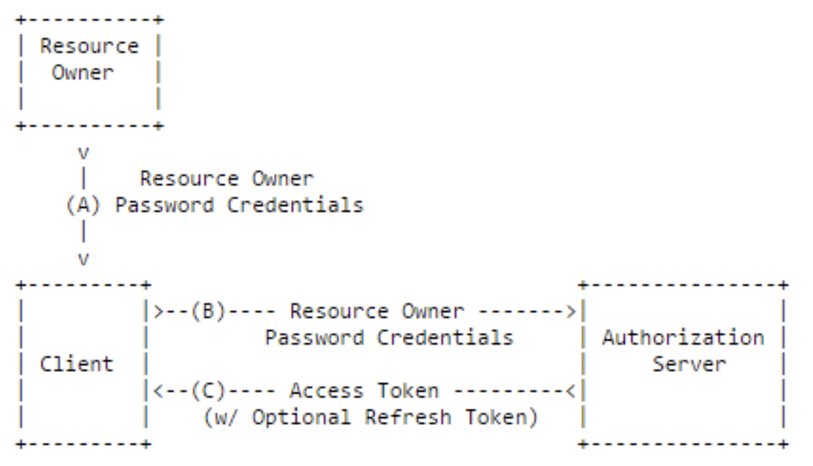

## 4. Resource Owner Password Credentials  Grant

	- Grant Type: password
	- Response Type: none
	- 클라이언트가 타사의 외부 Application이 아닌 자신의 클라이언트 애플리케이션인 경우에만 사용
	- Refresh Token의 사용 가능
	- 간단하게 자격 인증 (Password Credention)로 Access Token을 받는 방식
