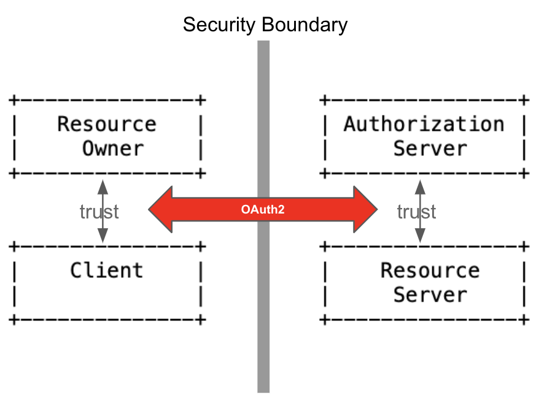

## 1. Basics

#### 1. OAuth2 프로토콜 구성 요소
다음은 OAuth2 보안 도메인의 구성 요소(Compoent)들이다. 자원 소유자를 제외하고 대부분은 OAuth2 상세에 맞게 소프트웨어로 개발되거나 구현되어야 한다.  

1. 보호 자원(Protected Resource)
	

	웹서비스의 서비스 데이터들이다. 예를 들면, 사진 서비스에서는 사용자들이 올린 사진, 블로그나 게시물 서비스에서는 사용자들의 포스트이다. 사용자 기반 웹서비스에서는 이런 자원에 접근하기 위해서 API라고 부르는 URL(엔드포인트, Endpoint) 형태로 접근하게 되고 또 접근 제한을  할 수 있다.
	

2. 자원 소유자(Resource Owner)
	

	보호 자원의 소유자를 가리킨다. 일반적으로 웹서비스의 사용자라 보면 된다. 웹서비스는 보호 자원에 접근하는 사용자가 그 보호 자원의 소유자임을 확인하면 보호 자원을 서비스한다. 
	

3. 자원 서버(Resource Server) 
	

	자원을 서비스하는 서버라는 의미로 앞에서 언급한 대로 API를 제공하는 웹서비스라 생각해도 큰 무리는 없다.
	

4. 클라이언트(Client) 
	

	보호 자원에 접근하려는 애플리케이션이다. 서비스 API를 직접 호출한다. 자원에 접근하는 클라이언트는 자원 소유자인 사용자에게 접근 권한(Authority)에 대한 인가(Authorization)를 우선 받아야 한다. 그리고 자원 서버는 그 인가가 유효한지 확인하고 서비스 한다.
	

5. 인가 서버(Authorization Server)
	

	자원 소유자는 클라이언트에게 자신의 자원에 대한 접근 권한 인가(Authorization)를 승인(Grant)해야 한다. 자원 소유자와 클라이언트 사이의 신뢰 관계가 만들어지는 과정이지만 둘 만의 신뢰 관계일 뿐, 클라이언트가 자원 소유자에게 인가 승인 받았다는 주장을 자원 서버는 믿어 줄 수 없다.  
	

	

	현실에서 이 상황을 비유해보면, 클라이언트는 자원에 대한 권한 주장을 공적인 법적 권위로 증명받고 그 증명을 들고 다니면서 자원에 대한 권한 행사를 해야 한다. 이를 공증이라 부른다. 
	

	

	OAuth2도 앞의 비유와 비슷하다. 법적 권위가 바로 인가 서버다. 그리고 증명이 되는 공증서류는 액세스 토큰 이다. 현실에서 공증서류는 법적으로 강력한 증거력을 갖고 있다. 마찬가지다. 클라이언트의 액세스 토큰은 자원에 접근할 수 있는 강력한 증거로 자원 서버에게 제출된다.   
	

#### 2. OAuth2 Abstract Flow
앞에서 살펴본 OAuth2의 주요 구성 요소들 사이의 프로토콜 플로우를 도식화하면 다음과 같다. 이 플로우는 OAuth2 프로토콜의 실제 구현 플로우 라기 보다는 구성 요소들의 역할과 상호작용, 그리고 핵심 개념을 설명하기 위한 추상적인 개념의 플로우이다.

<pre>
+--------+                               +---------------+
|        |--(A)- Authorization Request -&gt;|   Resource    |
|        |                               |     Owner     |
|        |&lt;-(B)-- Authorization Grant ---|               |
|        |                               +---------------+
|        |
|        |                               +---------------+
|        |--(C)-- Authorization Grant --&gt;| Authorization |
| Client |                               |     Server    |
|        |&lt;-(D)----- Access Token -------|               |
|        |                               +---------------+
|        |
|        |                               +---------------+
|        |--(E)----- Access Token ------&gt;|    Resource   |
|        |                               |     Server    |
|        |&lt;-(F)--- Protected Resource ---|               |
+--------+                               +---------------+
</pre>

1. (A), (B)
	

	클라이언트는 자원 서버로의 자원 요청(E)을 위해 먼저 자원 소유자에게 자원에 대한 권한 인가(Authorization)를 요청한다. 자원 소유자는 클라이언트에게 자원에 대한 권한 인가를 승인(Grant) 한다. 
	

2. (C) , (D)	
	

	클라이언트는 인가 서버에게 자원 소유자에게 받은 권한 인가 승인에 대한 액세스 토큰 발급을 요청한다. 인가 서버는 인가 승인을 액세스 토큰으로 발급한다. (인가 승인에 대한 공신력 있는 제3자 공증 행위 쯤?)
	

3. (E), (F) 	
	

	클라이언트는 자원 서버에게  발급 받은 토큰과 함께 보호된 자원을 요청한다.  자원 서버는 토큰을 발급한 인가 서버를 통해 토큰의 유효성을 확인(Introspection)하고 보호된 자원을 클라이언트에게 서비스 한다. 
	

#### 3. OAuth2 Features
1. Authorization
	

	OAuth2는 권한에 대한 인가(Authorization)에만 관심을 가진다. 그리고 자원 소유자가 클라이언트에게 승인한 권한 인가를 완벽히 보증하고 자원을 안전히 보호하는 프로토콜이다.
	

	
2.  Delegated Authorization
	

	OAuth2는 자원 소유자의 자원 접근 권한을 클라이언트에게 위임(Delegate)하는 프로토콜이다. OAuth2는 이 위임 과정을 여러 인가 승인 타입(Authorization Grant Type)으로 상세한다. OAuth2 구현은 바로 이 인가 승인에 참여하고 있는 구성 요소와 그 과정을 구현하는 것이다.   
	

	

	한편, OAuth2는 자원 서버가 해야하는 승인된 인가 확인을 인가 서버에게 위임하게 한다.  따라서 OAuth2는 자원소유자/클라이언트 그리고 자원서버/인가서버 간에 신뢰 관계를 기본 전제로 한다. 그리고 이 둘 관계 사이에 있는 복잡한 보안 문제를 OAuth2는 비교적 단순한 방식으로 해결한다.  
	

	

	
3. Access Token
	

	OAuth2의 인가 승인 플로우에서 인가 승인의 물리적 증거는 액세스 토큰(Access Token)이다. 자원 소유자가 클라이언트에게 하는 자원에 대한 인가 승인을 액세스 토큰 발급으로 보증한다. 인가 서버가 둘 사이에 위치하여 이 역할을 한다. 
	

	

	한편, 자원 서버는 클라이언트의 접근과 함께 제출한 토큰으로 이 접근이 자원 소유자의 인가 승인을 받은 접근인지 아닌지 판단해야 한다. 당연히 이는 토큰을 발급한 인가 서버가 대신 확인해 준다.
	

#### 3. Authorization Grant Type 
"OAuth2의 핵심은 자원 소유자의 자원에 대한 권한 <strong>인가 승인(Authorization Grant)</strong>, 이를 보증하는 <strong>액세스 토큰(Access Token)</strong> 그리고 액세스 토큰으로 자원 접근이다." 

OAuth2는 실제 구현(Practical Implementation)을 위한 인가 승인 타입(Authorization Grant Type)이라는 모델들을 상세하고 있다. 대부분의 표준 상세가 그렇지만, OAuth2도 모델만을 제시할 뿐 구체적인 기술들에 대한 상세는 따로 없다. 따라서 구현에서도 플랫폼, 개발언어, 통신 방식도 자유롭다. 하지만 실제적으로는 OAuth2 구성 요소들 사이의 HTTP 통신으로 구현되며 구성 요소들은 소프트웨어 또는 구현 코드가 된다. 예제는 다음과 같은 기술들로 구성 요소와  Authorization Grant Flow를 구현한다.

1. Authorization Server
	- JBoss Keycloak 솔류션
2. Resource Server
	- Spring Web
	- Spring Security OAuth
3. Client
	- Spring Security OAuth
4. Access Token
	- JWT     

각 기술의 기초적인 내용은 다음을 참고한다.
1. [참고1] JBoss Keycloak SSO Solution
2. [참고2] Spring Security Basics
3. [참고3] JWT

OAuth2에서 상세하고 있는 Authorization Grant Type은 다음의 네 가지 이다.
1. Authorization Code Grant
2. Implicit Grant
3. Resource Owner Password Credentials Grant
4. Client Credentials Grant

#### 4. Authorization Code Grant Type
1. Authorization Code	
	
	- Grant Type: authorization_code, code
	- Response Type: code
	- Standard Flow
	- 권한 부여 승인을 위해 자체 생성한 Authorization Code를 전달하는 방식으로 많이 쓰이고 기본이 되는 방식
	- 간편 로그인 기능에서 사용되는 방식
	- 클라이언트가 사용자를 대신하여 특정 자원에 접근을 요청할 때 사용되는 방식
	- 타사의 클라이언트에게 보호된 자원을 제공하기 위한 인증에 사용
	- Refresh Token의 사용이 가능한 방식
	- 권한 부여 승인 요청 시 response_type을 code로 지정하여 요청
	- 클라이언트는 권한 서버에서 제공하는 로그인 페이지를 브라우저를 띄워 출력 (A), (B)
	- 페이지를 통해 사용자가 로그인을 하면 권한 서버는 권한 부여 승인 코드 요청 시 전달받은 redirect_url로 Authorization Code를 전달 (B), (C)
	-  Authorization Code는 권한 서버에서 제공하는 API를 통해 Access Token으로 교환 (D), (E)
	
2. Implicit Grant
	
	- Grant Type: none
	- Response Type: token
	- 자격증명을 안전하게 저장하기 힘든 클라이언트에게 최적화된 방식
	- 암시적 승인 방식에서는 권한 부여 승인 코드 없이 바로 Access Token이 발급
	- Access Token이 바로 전달되므로 만료기간을 짧게 설정하여 누출의 위험을 줄인다.
	- Refresh Token 사용이 불가능한 방식
	- Access Token을 획득하기 위한 절차가 간소화
	- Access Token이 URL로 전달된다는 단점

3. Resource Owner Password Credentials ***
	
	- Grant Type: password
	- Response Type: none
	- 클라이언트가 타사의 외부 Application이 아닌 자신의 클라이언트 애플리케이션인 경우에만 사용
	- Refresh Token의 사용 가능
	- 간단하게 자격 인증 (Password Credention)로 Access Token을 받는 방식

4. Client Credentials
	
	- Grant Type: client_credentials
	- Response Type: none
	- 클라이언트의 자격 증명만으로 Access Token을 획득하는 방식
	- 클라이언트 자신이 관리하는 리소스에만 접근 가능
	- 자격 증명을 안전하게 보관할 수 있는 클라이언트에서만 사용
	- Refresh Token은 사용할 수 없다.

