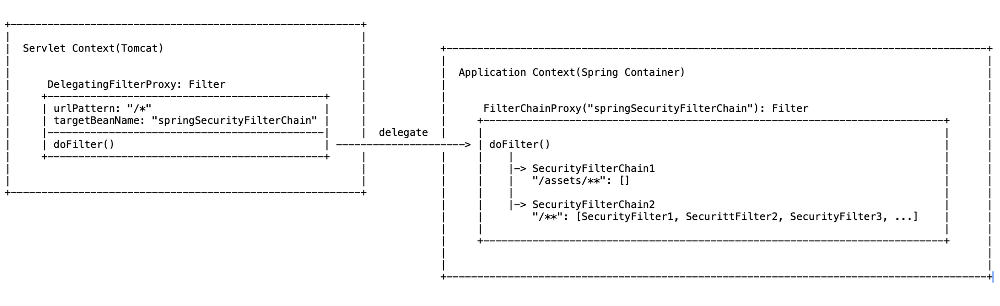

## 1. Spring Security Architecture

#### 예제
1. /oauth2-practices/spring-security-basics
2. FilterChainProxy Bean 명시적 생성
3. Security Configuration1
	- me.kickscar.spring.security.config.explicit.SecurityConfig01
	- SecurityFilterChain 직접 구현
	- test: me.kickscar.spring.security.config.explicit.SecurityConfig01Test  
4. Security Configuration2
	- me.kickscar.spring.security.config.explicit.SecurityConfig02
	- DefaultSecurityFilterChain(Spring Security) 사용
	- test: me.kickscar.spring.security.config.explicit.SecurityConfig02Test
	