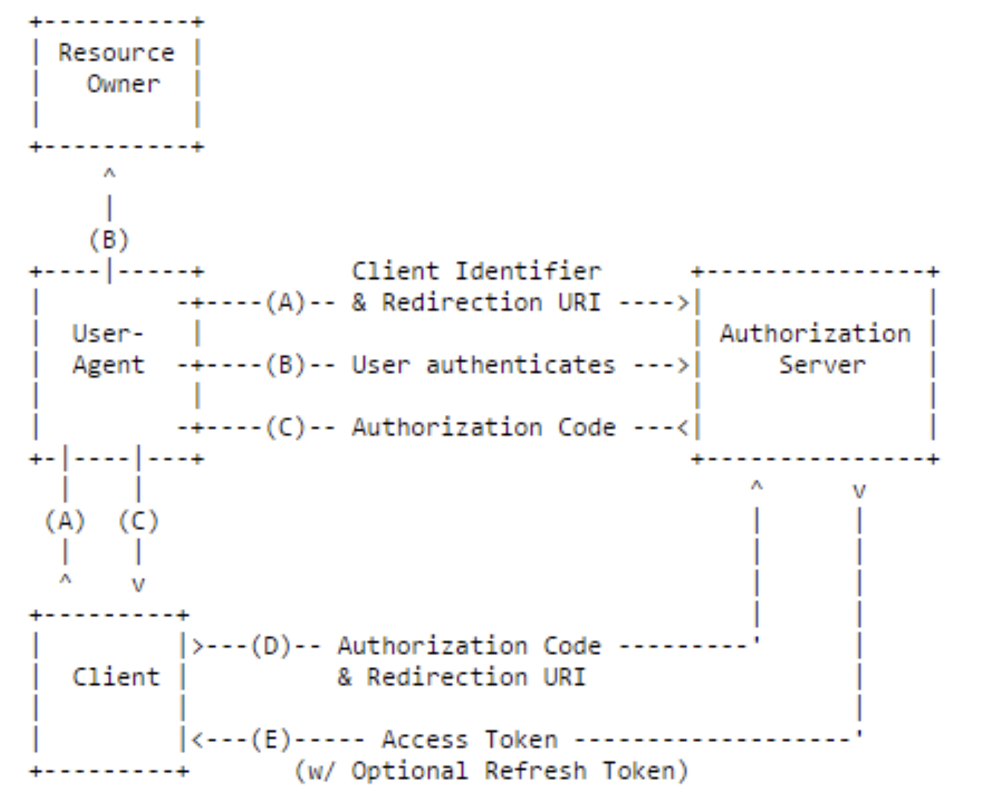
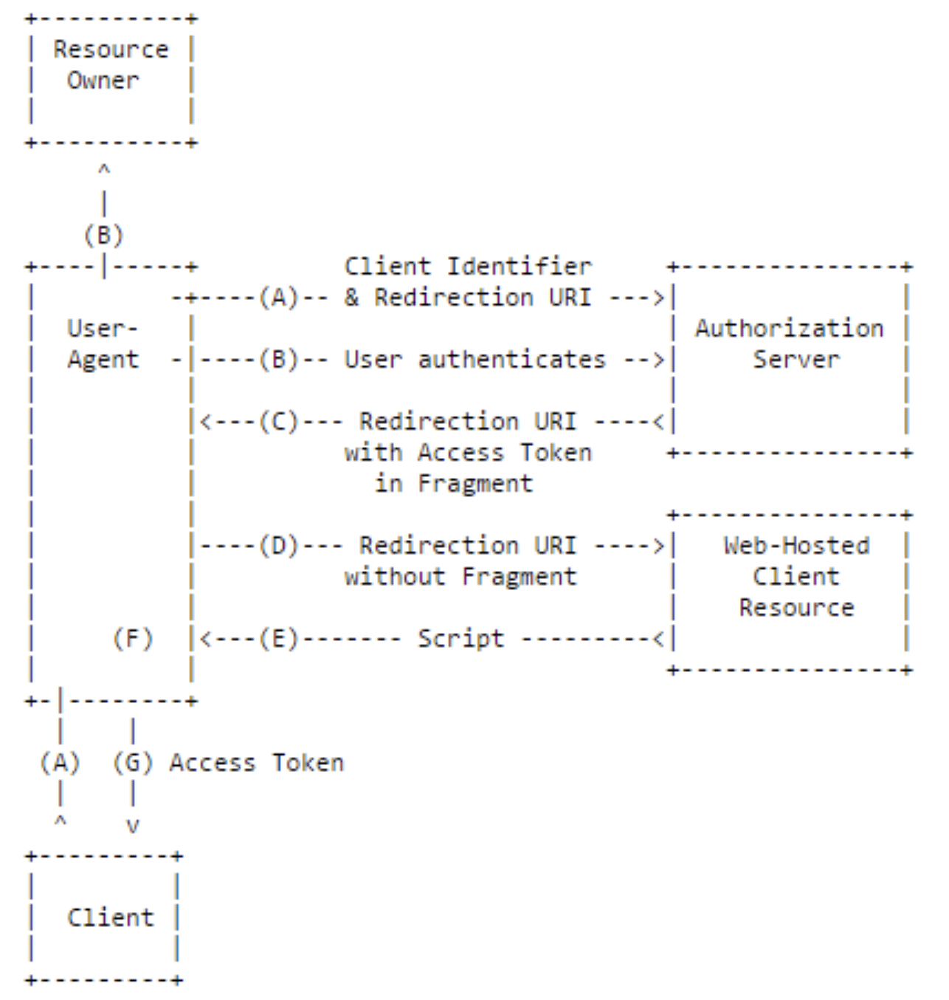
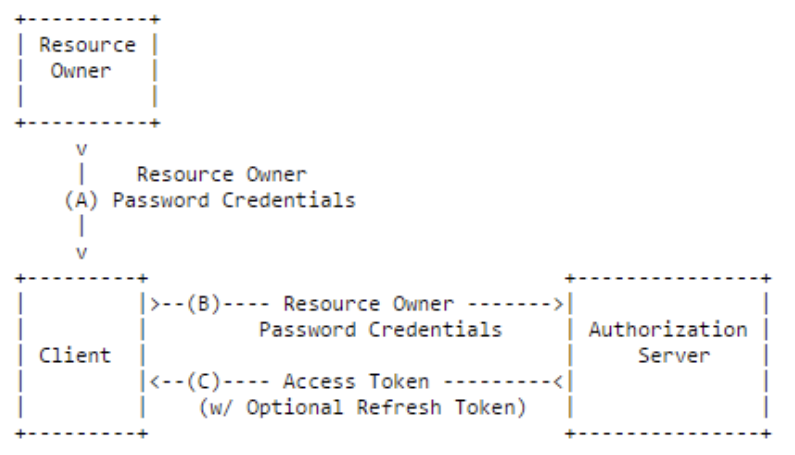
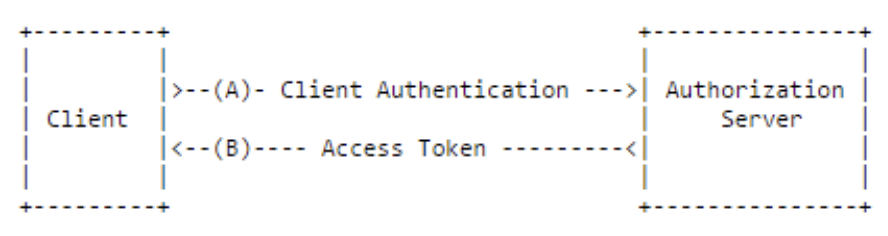

## 1. OAuth2 Basics

#### 1. OAuth2 (Open Authorization 2.0) ?
Token 기반의 보안 프레임워크으로 인증(Authentication)과 인가(Authorization)에 대한 패턴을 정의

#### 2. OAuth2 Security Terminolgy
1. 보호 자원(Resource)
	

	자격(권한, Authority)이 있는 접근에 대해서만 제공되는 보호대상이 되는 자원을 의미한다. MSA에서는 서비스들의 API 이다. 
	

	
2. 자원 서버(Resource Server) 
	

	보호 대상이 되는 자원을 제공하는 서버다. MSA에서는 구현 서비스가 된다.
	

3. 클라이언트(Client) 
	
 
	보호 자원에 접근하려는 애플리케이션이다. 보통, 서비스들의 API를 호출한다. 당연히, 클라이언트는 보호 자원을 제공하는 자원 서버에게 허락(인가)를 받아야 한다. 자원 서버가 자원 제공과 함께 이 인가를 해주는 것이 어찌보면 당연하다. 그리고 이런 방식으로 서비스를 많이 개발한다. 하지만, MSA에서는 얘기가 조금 다르다. MSA를 구성하는 다수의 서비스(자원 서버)들이 이 인가 작업을 개별적으로 하게되면 클라이언트가 다수의 서비스에 자원 요청을 할 때 마다 서비스별로 인증과 인가를 따로따로 받아야 한다. 불가능한 것은 아니지만 불편하다. 이 불편함을 해결할 수 있는 것이 바로  OAuth2 이다.  OAuth2는 딱! 한 번의 인증과 인가로 여러 자원 서버의 자원을 요청할 수 있는 방법을 제공한다.
 	

 
4. 자원 소유자(Resource Owner)
	

	자원에 접근하려는 클라이언트에게 접근 자격(Grant)을 부여하는 주체라는 다소 추상적인 개념이다. 일반적인 애플리케이션 또는 서비스에서는 사용자(End User)로 통용된다. 자원 소유자가 하는 개념적인 역할은 다음과 같은 것이 있다.
	
	
	
	- 클라이언트(Client, Application)가 접근 가능한 자원(서비스) 정의
	- 클라이언트의 사용자에 대한 접근 권한(Authority) 정의
	- 클라이언트의 자원 접근에 대한 제어	
	
	
	 
	 자원 소유자가 정의하는 클라이언트는 이름과 비밀키(Secret Key)가 지정된다.  이름과 키 조합은 인증 서버가 발급(issue)하는 Access Token의 자격 증명(Credential)의 일부가 된다. 
	
	 

5. 인가(Authorization) 
	

	특정 자원에 대한 접근 권한(Authority)를 부여(Grant) 하는 것이다. 접근이라는 것이 클라이언트 애플리케이션의 API URL과 HTTP Method의 조합으로 이루어지기 때문에 실제로 권한은 애플리케이션의 사용자(Principal, 접근 주체) 들에게 부여된다 볼 수 있다. 따라서 사용자의 신원(Identity)을 확인하는 인증(Authentication)이 인가 전에 선행된다. 따라서 개념적으로는 인가에는 인증이 포함되어 있다.
	
	

6. 인증(Authentication)
	
 
	특정 자원에 접근하는 접근 주체(Principal)인 사용자는 자격 증명(Credentials)을 제출해 신원(Identity)을 먼저 확인받고 신원에 부여(Grant)된 접근 권한(Authority)으로 자원 서버에게 인가를 받아 보호된 자원에 접근하게 된다. 이 중에 맨 앞의 자격 증명(Credentials)을 제출해 신원(Identity)을 먼저 확인받는 것을 인증이라 한다. 애플리케이션 사용자 입장에서 보면 로그인 또는 사인인(Sign-in)이라 부르는기능이다. 보안 측면에서 보면 sign-in 이라는 말이 더 맞는 거 같다.
	

	
7. 인증 서버 (Authorization Server)
	

	인증을 수행하고 클라이언트의 접근 권한 확인을 위한 Access Token을 발급하는 역할을 수행한다. 개념적으로 자원 소유자가 정의한 자원 접근 권한을 자원에 접근하는 클라이언트에게 실제 부여하는 수행 작업을 한다. MSA에서 클라이언트는 인증 서버로의 단 한 번의 인증과 부여 받은 권한으로 인가된 서비스 접근이 가능해진다. 이를 SSO(Single Sign-On) 이라 한다. 
	

#### 3. Authorization Grant Flows
자원에 접근하려는 클라이언트가 인증을 받고 부여된 권한이 포함된 Access Token를 발급 받기 까지의 플로우를 OAuth2는 다음의 네가지 방식으로 상세하고 있다. 우리는 개발하려고 하는 애플리케이션 또는 서비스의 보안 인프라에 맞는 플로우를 먼저 이 중에서 선택해야 한다. 그리고 선택한 플로우의 표준 규격을 잘 이해하고 클라이언트, 리소스 서버 그리고 인증 서버 이렇게 크게 세 부분으로 나눠 실제 보안 개발을 해야 한다.

한편, OAuth2 표준 규격에는 Access Token의 상세, 인증 방식, 권한을 다루는 방법 그리고 인가 방식 등은 전혀 언급하지 않는다. 응용개발에서 다루어야 하는 것들이기 때문이다. 우리는 Access Token 상세는 JWT 표준 상세를 사용할 것이다. 인증 방식과 권한을 다루는 방법 등은 Spring Authorization Server  Framework도  좋은 선택이지만 JBoss의 Keycloak 솔루션을 사용한다. 인가 방식을 다루는 리소스 서버와 플로우를 수행하는 OAuth2 클라이언트는 Spring Security  Framework의 OAuth API를 사용한다.      

1. Authorization Code	
	
	- Grant Type: authorization_code, code
	- Response Type: code
	- Standard Flow
	- 권한 부여 승인을 위해 자체 생성한 Authorization Code를 전달하는 방식으로 많이 쓰이고 기본이 되는 방식
	- 간편 로그인 기능에서 사용되는 방식
	- 클라이언트가 사용자를 대신하여 특정 자원에 접근을 요청할 때 사용되는 방식
	- 타사의 클라이언트에게 보호된 자원을 제공하기 위한 인증에 사용
	- Refresh Token의 사용이 가능한 방식
	- 권한 부여 승인 요청 시 response_type을 code로 지정하여 요청
	- 클라이언트는 권한 서버에서 제공하는 로그인 페이지를 브라우저를 띄워 출력 (A), (B)
	- 페이지를 통해 사용자가 로그인을 하면 권한 서버는 권한 부여 승인 코드 요청 시 전달받은 redirect_url로 Authorization Code를 전달 (B), (C)
	-  Authorization Code는 권한 서버에서 제공하는 API를 통해 Access Token으로 교환 (D), (E)
	
2. Implicit
	
	- Grant Type: none
	- Response Type: token
	- 자격증명을 안전하게 저장하기 힘든 클라이언트에게 최적화된 방식
	- 암시적 승인 방식에서는 권한 부여 승인 코드 없이 바로 Access Token이 발급
	- Access Token이 바로 전달되므로 만료기간을 짧게 설정하여 누출의 위험을 줄인다.
	- Refresh Token 사용이 불가능한 방식
	- Access Token을 획득하기 위한 절차가 간소화
	- Access Token이 URL로 전달된다는 단점

3. Resource Owner Password Credentials ***
	
	- Grant Type: password
	- Response Type: none
	- 클라이언트가 타사의 외부 Application이 아닌 자신의 클라이언트 애플리케이션인 경우에만 사용
	- Refresh Token의 사용 가능
	- 간단하게 자격 인증 (Password Credention)로 Access Token을 받는 방식

4. Client Credentials
	
	- Grant Type: client_credentials
	- Response Type: none
	- 클라이언트의 자격 증명만으로 Access Token을 획득하는 방식
	- 클라이언트 자신이 관리하는 리소스에만 접근 가능
	- 자격 증명을 안전하게 보관할 수 있는 클라이언트에서만 사용
	- Refresh Token은 사용할 수 없다.

