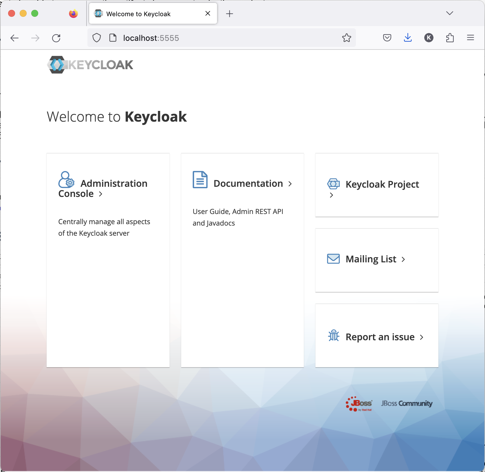
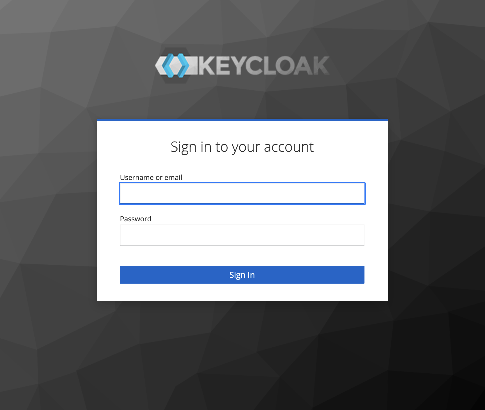

## 2. OAuth2 Implementation I - OAuth2 Authorization Server

#### 1. [Spring Security Project](https://spring.io/projects/spring-security)
Spring Security 프레임워크 기반으로 OAuth2의 Authorization Server 및 Client 그리고 Resource Server 구현이 가능하였다. 하지만 2022년 6월, Spring Security Project는 OAuth2의 Client 및 Resource Server 구현 지원만 남기고 Authorization Server는 Spring Authorization Server 라는 이름의 단독 프로젝트로 이관 시켰다.

#### 2. [Spring Authorization Server](https://spring.io/projects/spring-authorization-server)
OAuth 2.1 스펙과 OpenID Connect 1.0 (OIDC) 스펙을 완벽히 지원하는 SSO(Single Sign-On) OAuth2 Authorization Server 작성을 가능하게 해주는 프레임워크이다. 


#### 3. Keycloak
1. Keycloak SSO Soultion
	<p>
	<a href='https://www.keycloak.org'>Keycloak</a>은 JBoss 팀이 개발한 Java 기반의  OAuth 2.1 , OIDC 1.0 그리고 SAML를 지원하는 SSO 솔류션이다. 2014년, RedHat이 JBoss를 인수하면서 RH-Keycloak 이라는 이름의 상용 솔류션을 출시했다. 한편, RedHat 내에 WildFly로 이름을 바꾼 JBoss 팀이 지속으로 Keycloak 오픈소스 프로젝트를 진행하고 있으며 현재(2023, 10월) 22.0.5 LTS 버젼까지 출시되어 있는 상태다.
	</p>

2. Keycloak Embeded
	<p>
	자바 기반의 오픈 소스 솔류션이기 때문에 다양한 방식으로 보안 인프라에 운용된다. 완성도가 높은 솔류션이기 때문에 별다른 커스터마이징과 코딩작업 없이 간단한 데이터베이스 설정과 함께 설치하여 운용이 가능하며 클라우드 환경의 도커 컨테이너 운용도 많이 선호하는 편이다.
	</p>
	<p>
	한편, Spring Cloud 기반 MSA 인프라에서는 Spring Boot에 임베드하는 방식도 많이 선택된다. 자바 기반이라 소스 레벨에서 Spring Boot에 임베드하기가 어렵지 않으며 커스터 마이징이 가능하다는 것도 큰 장점이다. 하지만, 무엇보다 Keyclock 자체를 Spring Cloud 기반의 MSA 서비스로 등록하여 고가용성을 확보할 수 있다는 것이 더 큰 매력이라 볼 수 있다.
 	</p>

#### 4. Keycloak Embeded
1. 예제 소스: /servers/embedded-springboot-keycloak-server/embedded-keycloak-server
2. 실행 환경
	- Keycloak 18.0.0
	- Java 11
	- Spring Boot 2.6.8
	- MariaDB 10.x
3. 주요 설정(application.yml)
	-	datasource
		
		```yaml
		datasource:
			driver-class-name: org.mariadb.jdbc.Driver
			url: jdbc:mariadb://localhost:3306/keycloak?characterEncoding=utf8
			username: keycloak
			password: keycloak
		```
	
	- server
		
		```yml
		server:
		  forward-headers-strategy: native
		  port: 5555
		  servlet:
		  context-path: "/"
		```
	
	-	keycloak
	
		```yml
		custom:
			server:
				keycloak-path: ""
				adminUser:
					username: admin
					password: admin
					create-admin-user-enabled: true
		```

4. 빌드
	```
	$ mvn clean install
	```

5. 실행
	```sh
	$ java -jar embedded-keycloak-server.jar
	```

6. 접근 (http://localhost:5555)
	
	
	
8. 관리자 로그인

	

#### 5. Keycloak Security Configuration Objects
Authorization Server가 인증을 수행하고 클라이언트의 접근 권한 확인을 위한 Access Token을 발급하기 위해서는 자원 소유자는 보호 자원과 클라이언트를 정의하고 접근 권한 또한 정의해야 한다.  바로 Keycloak 설정을 통해 가능하다. 이런 보안 설정 대상이 되는 Keyclock의 몇 가지 주요 개념이 있다.

1. realm
	<p>
	사용자, 자격 증명, 역할 및 그룹 집합 등을 관리하는 대상이다. 사용자는 realm에 속하고 자격증명을 통해 인증을 받을 것이다. realm은 격리되어 있고 realm에 속한 사용자만 관리하고 인증된다.
	</p>
	
2. client
	<p>
	OAuth2 스펙에 정의된 client와 다르지 않은 개념이다. 보호 자원을 제공하는 자원 서버에게 인가를 받아야 하는 대상이다. Keycloak은 자원 서버가 인가를 할 수 있도록 자원 소유자가 정의한 클라이언트에 정의된 권한을 인증된 Realm 사용자에게 부여한다. 사용자는 여러 클라이언트의 권한을 부여 받을 수 있지만 클라이언트에 부여된 이름과 비밀키(Secret Key)가 사용자 인증에 필요한 자격 증명의 일부가 되기 때문에 특정 클라이언트의 권한만 부여 받아 클라이언트가 접근하려는 자원에만 인가 될 것이다.
	</p>
	
4. role
	<p>
	자원 소유자는 사용자와 클라이언트에 대한 권한과 액세스 수준을 정의하고 관리하는 데 role를 사용할 수 있다. 롤은 사용자나 클라이언트가 자원에 대해 수행할 수 있는 작업을 지정하는 데 사용된다.
	</p>
	
6. user
	<p>
	자격 증명을 통해 인증을 받고 role로 표현된 자원 소유자가 정의해 놓은 권한을 부여받 자원 서버에 인가되어 자원에 접근할 수 있게 된다.
	</p>
	
#### 6. Keycloak Security Configuration : realm
1. Ream 생성
	
	- Add Realm 버튼 클릭
	<br>
	
	
	- Name 입력
	- Create 버튼 클릭
	<br>

2. 생성 완료
	
	- Token 탭에서 Token의 세부사항을 설정 할 수 있다.
	<br>

#### 7. Keycloak Security Configuration : clients
1. Client 생성
	
	- Create 버튼 클릭
	<br>
	
	

#### 8. Keycloak Security Configuration : roles

#### 9. Keycloak Security Configuration : users

#### 10. Test


